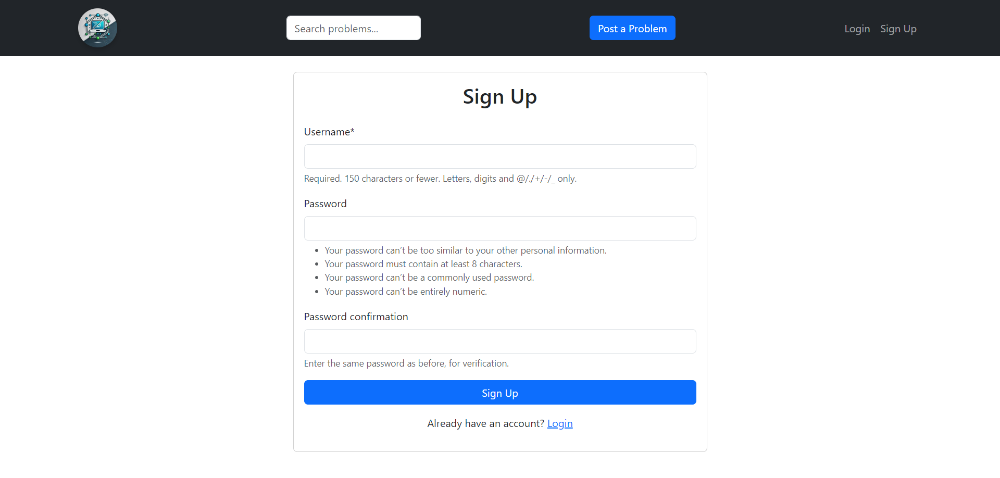

# CodeConnect

CodeConnect is a platform similar to StackOverflow, where users can share programming problems, post solutions, and interact with others. Features include account management, posting problems and solutions, viewing details of problems and solutions, and voting on solutions.

## Features

- **Account Management:**
  - User can sign up, log in, log out, and edit their profile.
- **Problem and Solution Management:**
  - Users can post programming problems.
  - Users can post solutions to problems.
  - View details of problems and solutions.
  - See the views and votes of problems and solutions.
  - Voting on solutions.
  
## Tech Stack

- **Backend:** Django MVT (Model-View-Template)
- **Database:** PostgreSQL
- **Frontend:** Bootstrap for design

## Project Structure

The project is built using the Django MVT pattern:

- **Model:** Represents the database structure (e.g., users, problems, solutions, votes).
- **View:** Contains the logic for handling requests and rendering appropriate templates.
- **Template:** The HTML files that are presented to the user (with Bootstrap for styling).

## Installation

### Prerequisites

Make sure you have the following installed on your local machine:
- Python 3.x
- PostgreSQL
- pip (Python package installer)

### Clone the Repository

```bash
git clone <repository_url>
cd <project_folder>
```
### Setup Virtual Environment
It's recommended to use a virtual environment to manage dependencies:

```bash
python -m venv venv
source venv/bin/activate  # On Windows, use `venv\Scripts\activate`
```
### Install Dependencies
```bash
pip install -r requirements.txt
```
### Configure PostgreSQL Database
1. Create a PostgreSQL database and user for the project.
2. Update the DATABASES setting in settings.py with your database details.
```python
DATABASES = {
    'default': {
        'ENGINE': 'django.db.backends.postgresql',
        'NAME': 'codeconnect_db',
        'USER': 'your_db_user',
        'PASSWORD': 'your_db_password',
        'HOST': 'localhost',
        'PORT': '5432',
    }
}
```
### Migrate the Database
Run the migrations to set up the database schema:
```bash
python manage.py migrate
```
### Create a Superuser
To access the admin panel, create a superuser account:
```bash
python manage.py createsuperuser
```
### Run the Development Server
Start the server:
```bash
python manage.py runserver
```
Visit http://127.0.0.1:8000/ in your browser to see the project in action.

## Screenshots
<!-- #### Home Page -->
- 
- 
- 
- 
- 
-  
-  
- 
- 
- 
- 

 

